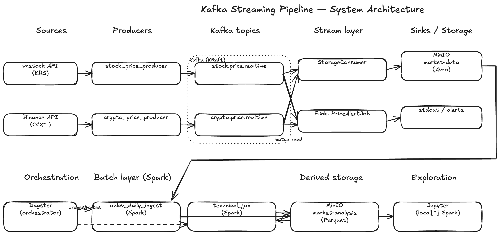

# Kafka Streaming Pipeline

A real-time data streaming pipeline for Vietnamese stock and cryptocurrency market data, built with Apache Kafka, MinIO, Apache Flink, Apache Spark, and (Phase 10) Dagster.

## Overview

Pull-based market APIs (vnstock, Binance) become a continuous push pipeline. Producers fetch once and publish to Kafka; any number of consumers (storage, alerts, batch jobs) read the same stream independently.



**Editable architecture diagram:** [`design/images/architecture.excalidraw`](design/images/architecture.excalidraw) — open in [excalidraw.com](https://excalidraw.com) (File → Open).

## Documentation

- [**design/DESIGN.md**](design/DESIGN.md) — system overview, data flow, key design decisions, storage schemas, phase plan
- **design/services/** — one design doc per Docker service:
  - [KAFKA.md](design/services/KAFKA.md) · [MINIO.md](design/services/MINIO.md) · [FLINK.md](design/services/FLINK.md) · [SPARK.md](design/services/SPARK.md) · [JUPYTER.md](design/services/JUPYTER.md) · [DAGSTER.md](design/services/DAGSTER.md) *(Phase 10)*
- [design/TEST.md](design/TEST.md) — testing strategy
- [design/SUGGESTION.md](design/SUGGESTION.md) — planning backlog

## Tech Stack

| Layer | Technology |
|---|---|
| Message broker | Apache Kafka 4.0 (KRaft, no ZooKeeper) |
| Object storage | MinIO (S3-compatible) |
| Stream processing | Apache Flink 2.0 + PyFlink |
| Batch processing | Apache Spark 4.1.1 (standalone Docker cluster) |
| Orchestration *(Phase 10)* | Dagster |
| Stock data | vnstock 4.0 (Vietnamese equities, KBS source) |
| Crypto data | CCXT (Binance) |
| Infrastructure | Docker Compose |

## Kafka Topics

| Topic | Partitions | Cadence | Purpose |
|---|---|---|---|
| `stock.price.realtime` | 6 | 30 s | Live HOSE price board snapshots |
| `crypto.price.realtime` | 6 | 5–60 s | Live Binance ticker snapshots |

OHLCV bars and technical indicators are **derived from the stored price snapshots** by Spark jobs — they don't flow through Kafka.

## Quick Start

**Prerequisites:** Docker, Python 3.12, `make`

```bash
git clone https://github.com/davidhoang2406/kafka-pipeline.git
cd kafka-pipeline
python3.12 -m venv .venv && source .venv/bin/activate

make install                  # interactive: select Kafka / MinIO / Flink / Spark / Jupyter
```

`make install` prompts for which services to start, then handles Docker builds, S3A JAR downloads, bucket creation, and topic creation.

## Running the Pipeline

Open a separate terminal for each long-running process:

```bash
# Producers (run continuously)
make run-stock-price-producer    # Vietnamese stocks → Kafka (every 30 s)
make run-crypto-price-producer   # Crypto prices → Kafka (every 5–60 s)

# Consumers (run continuously)
make run-storage-consumer        # Kafka → MinIO (Avro, partitioned by asset_class/symbol/date)

# Flink job (requires Flink containers running)
make run-flink-alert             # Submit PriceAlertJob — stateful price threshold alerts

# Spark batch jobs (run once at end of day; requires Spark containers running)
make run-ohlcv-daily-ingest      # Derive OHLCV bars from today's snapshots → MinIO Parquet
make run-spark-technical         # SMA/RSI/MACD/BB indicators over OHLCV history
```

## Infrastructure UIs

| Service | URL | Credentials |
|---|---|---|
| Kafka UI (topic/partition browser) | http://localhost:8080 | — |
| MinIO Web Console | http://localhost:9001 | minioadmin / minioadmin |
| Flink Web UI | http://localhost:8081 | — |
| Spark Master Web UI | http://localhost:8082 | — |
| Spark History Server | http://localhost:18080 | — |
| JupyterLab | http://localhost:8888 | no token |

## Storage Layout

**`market-data`** — raw streaming, 30-day expiry:
```
price.snapshot/asset_class={stock|crypto}/symbol={SYM}/year={Y}/month={M}/day={D}/part-{ts}.avro
```

**`market-analysis`** — derived/processed, no expiry:
```
ohlcv.bar/asset_class={stock|crypto}/year={Y}/month={M}/day={D}/part-{ts}.parquet
technical.indicators/year={Y}/month={M}/day={D}/part-{ts}.parquet
```

## Alert Rules

Rules in `config/alerts.json` are evaluated by `PriceAlertJob` (Flink, stateful):

```json
[
  {"source": "stock",  "symbol": "*",        "field": "pct_change", "operator": "<=", "threshold": -3.0, "message": "Sharp drop — down 3% or more"},
  {"source": "crypto", "symbol": "BTC/USDT", "field": "pct_change", "operator": "<=", "threshold": -3.0, "message": "BTC dropped 3% or more"}
]
```

## Testing

```bash
make test               # All tests (Docker must be running for integration)
make test-unit          # Unit tests only (no Docker needed)
make test-integration   # Integration tests (requires Kafka + MinIO running)
```

## Project Structure

```
├── docker/                     # docker-compose.yml + service Dockerfiles
├── config/                     # stocks.json, crypto.json, alerts.json
├── producers/                  # stock_price_producer, crypto_price_producer
├── consumers/                  # storage_consumer (Kafka → MinIO)
├── model/                      # MinioStore, SparkFactory, Avro/Parquet schemas
├── analysis/
│   ├── stream/price_alert_job.py        # Flink alert job
│   └── batch/
│       ├── ohlcv_daily_ingest.py        # Spark: snapshots → OHLCV
│       └── technical_job.py             # Spark: OHLCV history → SMA/RSI/MACD/BB
├── schemas/                    # build_envelope() — common Kafka message wrapper
├── db/                         # MinIO bucket init and flush utilities
├── tests/                      # unit/ and integration/ with pytest markers
├── design/                     # DESIGN.md + per-service docs in services/
├── reports/                    # Generated analysis output (gitignored)
└── main.py                     # CLI entry point
```

## Implementation Phases

| Phase | Status | What was built |
|---|---|---|
| 1  | ✅ | Docker Compose (Kafka + MinIO), bucket init, topic creation |
| 2  | ✅ | Smoke producer + consumer |
| 3  | ✅ | `stock_price_producer` — vnstock polling loop |
| 4  | ✅ | `storage_consumer` — Kafka → MinIO (Avro) |
| 5  | ✅ | `alert_consumer` — stateless Python alerter (superseded by `PriceAlertJob` in Phase 7; removed) |
| 6  | ✅ | `crypto_price_producer` — CCXT/Binance polling |
| 7  | ✅ | `PriceAlertJob` — PyFlink DataStream + KeyedProcessFunction |
| 8  | ✅ | `ohlcv_daily_ingest` — Spark Docker cluster, S3A, derive OHLCV |
| 9  | ✅ | `TechnicalJob` — SMA/RSI/MACD/BB over OHLCV Parquet history |
| 10 | 📋 | **Dagster orchestrator** — asset-centric scheduling of batch jobs |
| 11 | 📋 | `DigestJob` — daily gainers/losers/volume digest |
| 12 | 📋 | `ScreenerJob` — P/E, D/E, EPS fundamental filter |
| 13 | 📋 | `VolatilityBurstJob` — Flink sliding window + per-symbol ValueState |
