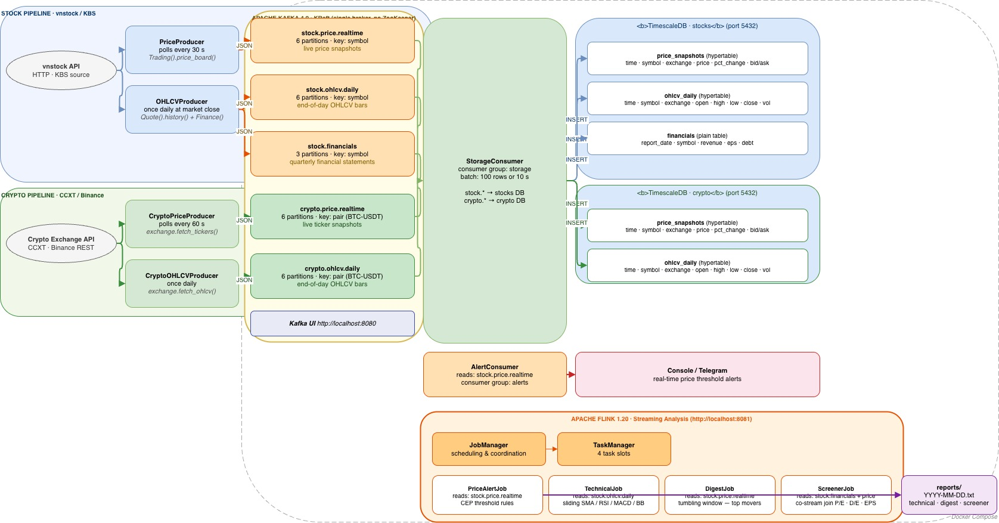

# Design Document: Stock & Crypto Data Streaming with Kafka

## 1. Problem Statement

Both vnstock (Vietnamese equities) and crypto exchanges expose data through pull-based APIs. Without a broker in the middle, every downstream script must call each API directly — no history, no fanout, no decoupling. Kafka solves this by converting the pull into a push pipeline:

```
vnstock API  ──┐
               ├──► Producers ──► Kafka ──► Consumer(s)
Crypto API   ──┘
```

Any number of consumers (database writer, alerter, Flink job, Spark job) can independently read the same stream without hitting the upstream APIs multiple times. Adding a new data source only requires a new producer; all existing consumers continue to work unchanged.

---

## 2. System Architecture

See **`architecture.drawio`** — open in [app.diagrams.net](https://app.diagrams.net) or the VS Code Draw.io extension.



**Data flow (left to right):**

```
vnstock API ──► stock_price_producer ──► stock.price.realtime ──┐
                                                                  ├──► StorageConsumer ──► market-data (MinIO, Avro)
Crypto API  ──► crypto_price_producer ──► crypto.price.realtime ─┘         │
                                                                             ▼
                                                                   ohlcv_daily_ingest (Spark)
                                                                             │
                                                                             ▼
                                                               market-analysis (MinIO, Parquet)
                                                                             │
                                                                             ▼
                                                               technical / digest / screener reports

Kafka topics ──► PriceAlertJob (Flink) ──► console alerts
             └──► AlertConsumer (Python) ──► console alerts
```

**Two-tier storage:**
- `market-data` — raw streaming data, 30-day lifecycle (raw is recoverable from upstream APIs)
- `market-analysis` — derived/processed data, no expiry (expensive to recompute)

---

## 3. Kafka Topic Design

| Topic | Partition Key | Retention | Purpose |
|---|---|---|---|
| `stock.price.realtime` | stock symbol (e.g. `VCB`) | 1 day | Live price board snapshots (vnstock KBS) |
| `crypto.price.realtime` | trading pair with `-` (e.g. `BTC-USDT`) | 1 day | Live ticker snapshots (CCXT/Binance) |

Both topics use 6 partitions and replication factor 1 (single-broker setup).

**Why partition by symbol?** Messages for the same asset always land on the same partition, preserving per-symbol ordering and enabling consumers that only care about a subset of symbols to read a single partition.

**Why no OHLCV or financials topics?** Daily bars are derived from the already-stored price snapshots — fetching them again from the upstream API would duplicate data and create a second source of truth. Routing derived data through Kafka when there is only one downstream reader (Spark) would add latency and complexity with no benefit. OHLCV is written directly to `market-analysis` by the Spark job.

---

## 4. Message Schema

All Kafka messages share a common JSON envelope:

```json
{
  "event_type": "price.snapshot",
  "symbol": "BTC/USDT",
  "exchange": "BINANCE",
  "timestamp": "2024-05-12T10:30:00+00:00",
  "source": "ccxt/binance",
  "payload": {
    "price": 62500.0,
    "change": 1200.0,
    "pct_change": 1.96,
    "volume": 1234567890,
    "bid": 62490.0,
    "ask": 62510.0
  }
}
```

The `source` field distinguishes origin (`"vnstock/KBS"` vs `"ccxt/binance"`). The `payload` shape is identical for the same `event_type` regardless of source — no special-casing in StorageConsumer or Flink jobs.

---

## 5. Component Breakdown

### `producers/stock_price_producer.py`
- Polls `Trading(source='KBS').price_board(symbols)` every 30 s
- Symbol list and exchange loaded from `config/stocks.json`
- Publishes to `stock.price.realtime` with key=symbol

### `producers/crypto_price_producer.py`
- Polls `exchange.fetch_tickers(symbols)` via CCXT every 5–60 s
- Exchange and symbol list loaded from `config/crypto.json` (default: Binance)
- Publishes to `crypto.price.realtime` with key=`BTC-USDT` (slash replaced with dash)

### `consumers/storage_consumer.py`
- Subscribes to `stock.price.realtime` and `crypto.price.realtime`
- Determines asset class from `source` field (`vnstock/*` → stock, `ccxt/*` → crypto)
- Batches rows in memory (up to 500 or 30 s), then flushes as deflate-compressed Avro to MinIO
- Partition layout: `price.snapshot/asset_class={stock|crypto}/symbol={symbol}/year={Y}/month={m}/day={d}/part-{ts_ms}.avro`

### `consumers/alert_consumer.py`
- Subscribes to both price topics; stateless Python alternative to the Flink job
- Evaluates each tick against rules from `config/alerts.json` and prints alerts to console

### `analysis/batch/ohlcv_daily_ingest.py`
- Spark job run once at end of trading day
- Reads today's price snapshot Avro files directly from MinIO via the S3A connector
- Aggregates per symbol: open = first-tick price, high = max, low = min, close = last-tick price, volume = sum
- Writes one Parquet file per asset class to `market-analysis`
- Asset class is inferred from the symbol: symbols containing `/` (e.g. `BTC/USDT`) are crypto; others are stock
- Output layout: `ohlcv.bar/asset_class={stock|crypto}/year={Y}/month={m}/day={d}/part-{ts_ms}.parquet`

### `analysis/price_alert_job.py`
- PyFlink DataStream job; stateful alternative to `alert_consumer.py`
- Reads from both price topics, partitions by symbol via `key_by`
- Evaluates each tick with a `KeyedProcessFunction` against `config/alerts.json` rules
- Submitted to the Flink cluster via `make run-flink-alert`

### `model/spark.py` — `SparkFactory`
- Context manager class wrapping Spark session lifecycle (`__enter__` returns the session, `__exit__` calls `stop()`)
- Selects master: `local[*]` when `SPARK_MASTER_URL` is unset (local dev), `spark://spark-master:7077` when running in Docker cluster
- Pre-configures S3A connector to reach MinIO (`fs.s3a.endpoint`, path-style access, credentials)
- Enables event logging to `/tmp/spark-events` so the Spark History Server can display completed jobs

### `model/minio_store.py`
- Centralised MinIO wrapper: bucket creation, lifecycle rules, Avro serialisation (fastavro), Parquet serialisation (PyArrow), object listing, and delete operations

---

## 5a. Storage Schema (MinIO)

### `market-data` bucket — raw streaming data (30-day lifecycle)

Deflate-compressed Avro. Files are appended continuously by StorageConsumer.

```
market-data/
└── price.snapshot/
    ├── asset_class=stock/
    │   └── symbol=VCB/
    │       └── year=2026/month=05/day=14/
    │           └── part-1715510400000.avro
    └── asset_class=crypto/
        └── symbol=BTC-USDT/
            └── year=2026/month=05/day=14/
                └── part-1715510400000.avro
```

**PriceSnapshot Avro schema:**

| Field | Type | Notes |
|---|---|---|
| `time` | string | ISO-8601 UTC timestamp of the tick |
| `symbol` | string | Stock ticker or crypto pair |
| `exchange` | string | Venue (HOSE, BINANCE, …) |
| `price` | double | Last/close price |
| `change` | double | Absolute price change |
| `pct_change` | double | Percentage change |
| `volume` | long | Accumulated volume |
| `bid` | double | Best bid |
| `ask` | double | Best ask |

### `market-analysis` bucket — derived data (no lifecycle expiry)

Snappy-compressed Parquet. Written once daily by the Spark OHLCV job.

```
market-analysis/
└── ohlcv.bar/
    ├── asset_class=stock/
    │   └── year=2026/month=05/day=14/
    │       └── part-1715510400000.parquet
    └── asset_class=crypto/
        └── year=2026/month=05/day=14/
            └── part-1715510400000.parquet
```

**OHLCVBar Parquet schema:**

| Field | Type | Notes |
|---|---|---|
| `time` | string | Date in ISO-8601 (`YYYY-MM-DDT00:00:00+00:00`) |
| `symbol` | string | |
| `exchange` | string | |
| `open` | float64 | Price of the first tick of the day |
| `high` | float64 | Maximum price across all ticks |
| `low` | float64 | Minimum price across all ticks |
| `close` | float64 | Price of the last tick of the day |
| `volume` | int64 | Sum of all tick volumes |

**Why Parquet for OHLCV and Avro for snapshots?**
Avro is row-oriented and embeds its schema — ideal for streaming appends where each record arrives individually. Parquet is columnar — ideal for analytical reads (e.g. "give me all closing prices for VCB over 200 days") that only need a subset of columns. OHLCV data is written in batch and queried analytically, making Parquet the right choice there.

---

## 5b. Streaming Layer — Apache Flink

The streaming layer is built on **Apache Flink 2.0**. All jobs are latency-sensitive — they lose value if results are delayed beyond seconds.

Flink runs two services in Docker Compose:
- **JobManager** — coordinates job scheduling, fault tolerance, and checkpointing (port 8081)
- **TaskManager** — executes the actual operators (4 task slots)

### `PriceAlertJob` ✅ implemented
- **Source:** `stock.price.realtime` + `crypto.price.realtime` (consumer group `flink-alerts`)
- Applies configurable threshold rules from `config/alerts.json` using `KeyedProcessFunction` — each symbol's ticks are evaluated independently
- **Sink:** console / logs

### `VolatilityBurstJob` 📋 planned
- **Source:** `stock.price.realtime` + `crypto.price.realtime`
- Uses a **sliding window** to track peak-to-trough price range per symbol; fires when intra-window range exceeds a configurable threshold
- Tracks min/max using `ValueState` — distinct from `PriceAlertJob` which only checks a single tick
- **Sink:** console / Telegram

### Key Flink concepts used
| Concept | Where applied |
|---|---|
| **DataStream API** | PriceAlertJob |
| **KeyedProcessFunction** | PriceAlertJob — per-record evaluation keyed by symbol |
| **Kafka source connector** | both jobs — managed offsets, consumer groups |
| **Sliding window + ValueState** | VolatilityBurstJob (planned) |

---

## 5c. Batch Layer — Apache Spark

The batch layer is built on **PySpark 4.1.1** and reads the Avro files written to MinIO by StorageConsumer. Jobs are triggered on a schedule (e.g. nightly) and suited to workloads requiring full historical data.

### Deployment

Spark runs as a **standalone Docker cluster** (not local mode) to mirror a production environment:

| Service | Role | Port |
|---|---|---|
| `spark-master` | Cluster coordinator | 7077 (submit), 8082 (Web UI) |
| `spark-worker` | Executor (2 cores, 2 GB RAM) | — |
| `spark-history-server` | Job monitoring UI (event logs) | 18080 |

`SparkFactory` resolves the master URL from `SPARK_MASTER_URL` env var — unset means `local[*]` (development), set to `spark://spark-master:7077` inside Docker.

S3A JARs (`hadoop-aws:3.4.1` + `software.amazon.awssdk:bundle:2.24.6`) are pre-baked into the custom Docker image — no runtime downloads.

### `ohlcv_daily_ingest` ✅ implemented

- **Source:** today's `price.snapshot` Avro files in `market-data`, listed via MinIO SDK and loaded by Spark S3A
- Aggregates with `groupBy("symbol", "exchange")`: open via `min(struct("time","price"))`, close via `max(struct("time","price"))`, high/low/volume via standard aggregations
- **Sink:** `market-analysis/ohlcv.bar/...` as Parquet

**Why derive OHLCV from snapshots rather than fetching from the API again?**
The price snapshots are already in MinIO — they *are* the source of truth for what prices were observed. Re-fetching OHLCV from vnstock/CCXT would create a second data lineage that might differ from the stored ticks (different API endpoints, different timestamps). Deriving OHLCV from what was actually stored makes the pipeline self-consistent.

### `TechnicalJob` ✅ implemented
- **Source:** all `ohlcv.bar` Parquet files in `market-analysis` (listed via MinIO SDK, loaded via S3A)
- Full window history is loaded per symbol so rolling indicators use all available bars
- **SMA 20/50/200** — `F.avg("close").over(Window.rowsBetween(-N+1, 0))` — pure Spark window aggregate
- **Bollinger Bands (20, ±2σ)** — `F.avg + F.stddev_pop` over the same 20-row window
- **RSI 14** — `F.lag("close", 1)` for per-row delta, then `F.avg` of gain/loss series over a 14-row window; avoids nested window functions by materialising `_gain`/`_loss` columns first
- **MACD (12/26/9)** — EMA requires sequential per-symbol computation; implemented via `groupBy("symbol").applyInPandas()` with `pandas.Series.ewm()` — demonstrates the boundary between Spark window functions and pandas UDFs
- All indicators are null-guarded: SMA200 is omitted when fewer than 200 bars exist; MACD is hidden during the EWM warmup period
- **Sink:** `reports/technical_YYYY-MM-DD.txt`

### `DigestJob` 📋 planned
- **Source:** `ohlcv.bar` Parquet from `market-analysis`
- Top gainers, losers, and volume spikes for the day
- **Sink:** `reports/digest_YYYY-MM-DD.txt`

### `ScreenerJob` 📋 planned
- **Source:** `ohlcv.bar` Parquet from `market-analysis`
- Filters symbols by P/E, D/E, EPS thresholds from `config/screener.json`
- **Sink:** `reports/screener_YYYY-MM-DD.txt`

### Key Spark concepts used
| Concept | Where applied |
|---|---|
| **SparkSession (cluster mode)** | SparkFactory — auto-selects local vs Docker cluster |
| **S3A connector** | reads Avro from `s3a://market-data/...`, writes Parquet to `s3a://market-analysis/...` |
| **DataFrame API** | ohlcv_daily_ingest — groupBy, agg, struct-sort trick for open/close |
| **Event logging** | SparkFactory → History Server at :18080 |
| **Window functions** | TechnicalJob — `Window.partitionBy/orderBy/rowsBetween`, `avg/stddev_pop` over rolling windows, `lag` for per-row delta |
| **applyInPandas (grouped map UDF)** | TechnicalJob — MACD uses `pandas.ewm()` inside a per-symbol pandas UDF when EMA is needed |

---

## 6. Local Infrastructure (Docker)

All services run via Docker Compose in `docker/docker-compose.yml`:

| Service | Image | Port(s) | Purpose |
|---|---|---|---|
| `kafka` | apache/kafka:4.0.0 | 9092 (host), 29092 (internal) | KRaft broker — no ZooKeeper |
| `kafka-ui` | ghcr.io/kafbat/kafka-ui | 8080 | Topic/partition/offset browser |
| `minio` | minio/minio:latest | 9000 (API), 9001 (console) | S3-compatible object storage |
| `flink-jobmanager` | custom (docker/flink.Dockerfile) | 8081 | Flink Web UI + coordinator |
| `flink-taskmanager` | custom (docker/flink.Dockerfile) | — | 4 task slots |
| `spark-master` | custom (docker/spark.Dockerfile) | 7077, 8082 | Spark cluster coordinator |
| `spark-worker` | custom (docker/spark.Dockerfile) | — | 2 cores, 2 GB RAM |
| `spark-history-server` | custom (docker/spark.Dockerfile) | 18080 | Completed job viewer |

Kafka 4.0 removed ZooKeeper entirely — the single broker runs in **KRaft mode** as both `broker` and `controller`.

Credentials (`MINIO_ACCESS_KEY`, `MINIO_SECRET_KEY`) are never hardcoded — they are read from environment variables (`.env` file) via Docker Compose `${VAR:-default}` substitution.

---

## 7. Project File Layout

```
Kafka/
├── docker/
│   ├── docker-compose.yml
│   ├── flink.Dockerfile        # PyFlink 2.0 + Kafka connector JAR
│   └── spark.Dockerfile        # apache/spark:4.1.1 + S3A JARs + Avro JAR
├── config/
│   ├── stocks.json             # HOSE symbols, exchange, poll interval
│   ├── crypto.json             # Binance pairs, poll interval
│   └── alerts.json             # Price threshold rules
├── producers/
│   ├── base_producer.py        # KafkaProducer context manager
│   ├── stock_price_producer.py # vnstock → stock.price.realtime
│   ├── crypto_price_producer.py # CCXT → crypto.price.realtime
│   └── utils.py                # coerce_float/int, load_json_config
├── consumers/
│   ├── base_consumer.py        # KafkaConsumer context manager
│   ├── storage_consumer.py     # Both price topics → MinIO (Avro)
│   └── alert_consumer.py       # Price threshold alerts (Python, stateless)
├── schemas/
│   └── message.py              # build_envelope() — common JSON wrapper
├── model/
│   ├── minio_store.py          # MinIO wrapper (Avro + Parquet read/write)
│   ├── schemas.py              # Avro (PriceSnapshot) + PyArrow (OHLCVBar) schemas
│   └── spark.py                # SparkFactory — session lifecycle + S3A config
├── analysis/
│   ├── stream/
│   │   └── price_alert_job.py      # Flink: KeyedProcessFunction price alerts
│   └── batch/
│       ├── ohlcv_daily_ingest.py   # Spark: snapshots → OHLCV bars → Parquet
│       └── technical_job.py        # Spark: OHLCV history → SMA/RSI/MACD/BB report
├── db/
│   ├── init_minio.py           # Creates market-data + market-analysis buckets
│   └── flush_minio.py          # Deletes all objects from a bucket (CLI arg)
├── tests/
│   ├── conftest.py             # Kafka + MinIO fixtures, unique consumer groups
│   ├── unit/                   # No external dependencies
│   └── integration/            # Requires Docker (Kafka + MinIO)
├── design/
│   ├── DESIGN.md               # This document
│   ├── TEST.md                 # Testing strategy
│   └── architecture.drawio     # System diagram
├── reports/                    # Generated analysis output (gitignored)
├── jars/                       # Flink Kafka connector JAR (local submission)
├── .env.example
├── requirements.txt
├── Makefile
└── main.py                     # CLI entry point
```

---

## 8. Implementation Phases

| Phase | Status | Goal | Concepts learned |
|---|---|---|---|
| **1** | ✅ | Docker Compose (Kafka + MinIO), bucket init, topic creation | Docker multi-service, MinIO S3 API |
| **2** | ✅ | Smoke producer + consumer (hardcoded VCB message) | Kafka: topics, producers, consumers |
| **3** | ✅ | `stock_price_producer.py` — vnstock polling every 30 s | Producer loop, serialisation, partition keys |
| **4** | ✅ | `storage_consumer.py` — Kafka → MinIO Avro (asset_class/symbol/date partitions) | Consumer groups, offset management, Avro, MinIO writes |
| **5** | ✅ | `alert_consumer.py` — threshold rules, same topic different group | Multiple consumer groups on a single topic |
| **6** | ✅ | `crypto_price_producer.py` — CCXT/Binance polling | Multi-source ingestion, normalised envelope |
| **7** | ✅ | `PriceAlertJob` — PyFlink DataStream + KeyedProcessFunction | Flink: DataStream API, Kafka connector, stateful processing |
| **8** | ✅ | `ohlcv_daily_ingest` — Spark Docker cluster, S3A, derive OHLCV from snapshots | Spark: cluster mode, S3A connector, struct-sort aggregation |
| **9** | ✅ | `TechnicalJob` — SMA/RSI/MACD/BB over OHLCV Parquet history | Spark: window functions, rolling indicators, applyInPandas for EMA |
| **10** | 📋 | `DigestJob` — gainers/losers/volume digest | Spark: DataFrame rankings, daily summary |
| **11** | 📋 | `ScreenerJob` — P/E, D/E, EPS filter | Spark: join, filter, config-driven thresholds |
| **12** | 📋 | `VolatilityBurstJob` — Flink sliding window + ValueState | Flink: sliding windows, per-symbol ValueState |

---

## 9. Key Kafka Concepts Encountered

- **Producer acknowledgment (`acks`)** — `acks=1` (fast, small loss risk) vs `acks=all` (durable). Use `acks=1` during development.
- **Consumer groups** — two consumers in the *same* group share partitions (load balancing); in *different* groups each receives a full copy. The alert and storage consumers must use different groups.
- **Auto offset reset** — `earliest` replays all stored messages on first start; `latest` only reads new ones.
- **Topic naming** — `<source>.<data-type>.<cadence>` (e.g. `crypto.price.realtime`) makes wildcard subscriptions easy.
- **Partition key** — using symbol as key means all ticks for a symbol land on the same partition, preserving order and enabling targeted partition reads.

---

## 10. Out of Scope (Intentional)

- **Schema registry** — plain JSON is sufficient to learn core concepts
- **Multi-broker cluster** — single broker is functionally identical from the application's perspective
- **WebSocket feeds** — CCXT REST polling is simpler and sufficient; WebSocket would replace the polling loop for sub-second latency
- **Crypto financials** — on-chain metrics (TVL, fees, staking APR) are out of scope
- **Cloud deployment** — everything runs locally via Docker; the same architecture maps directly to AWS MSK + S3 + EMR in production
